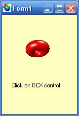



## Animation button Control \(Animated button ocx with region\) cool \!\!

### Description

This is an animated OCX control. It can use in your program as Button. There are sound and events with different animation and speed control as simple script language for it!!

&lt;&lt;&lt;&lt;&lt;&lt;&lt;Please don&#8217;t forget for vote and comment&gt;&gt;&gt;&gt;&gt;&gt;&gt;&gt;

In project directory there is some *.inf file. that you can write appropriate sound effect and key frame and speed for your different controls in your projects.
 
### More Info
 

             |
---                |---
**Submitted On**   |2004-06-24 09:14:58
**By**             |[Nader Naderi](https://github.com/Planet-Source-Code/PSCIndex/blob/master/ByAuthor/nader-naderi.md)
**Level**          |Beginner
**User Rating**    |3.7 (11 globes from 3 users)
**Compatibility**  |VB 6\.0
**Category**       |[Custom Controls/ Forms/  Menus](https://github.com/Planet-Source-Code/PSCIndex/blob/master/ByCategory/custom-controls-forms-menus__1-4.md)
**World**          |[Visual Basic](https://github.com/Planet-Source-Code/PSCIndex/blob/master/ByWorld/visual-basic.md)
**Archive File**   |[Animated\_C197048262006\.zip](https://github.com/Planet-Source-Code/nader-naderi-animation-button-control-animated-button-ocx-with-region-cool__1-64245/archive/master.zip)

